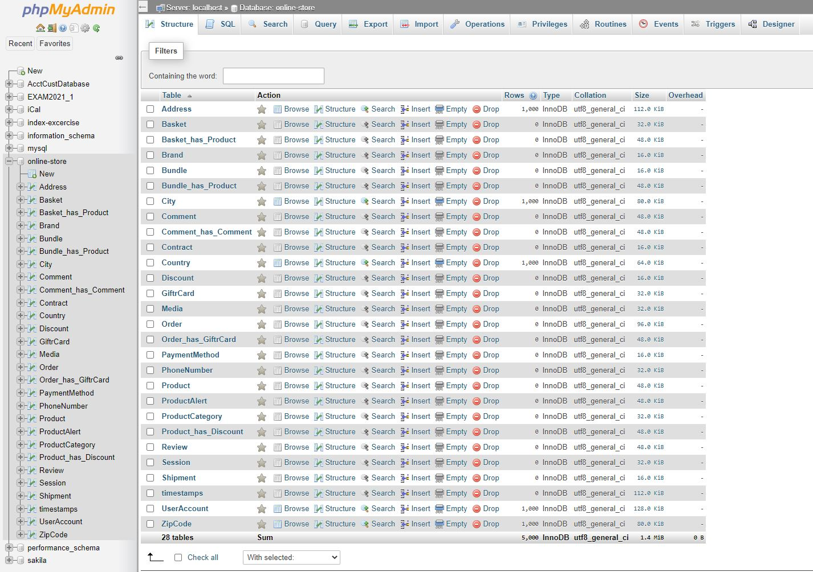

# Advanced Databases Project: Online Store

- Joel Aalto (M2113)
- Samson Azizyan (M3156)
- Jaber Askari (M2947)

The goal is to create the database for the template of the online store,
that can be personalized in the future for various types of products / services.

## Table Of Contents 

- [Advanced Databases Project: Online Store](#advanced-databases-project-online-store)
  - [Table Of Contents](#table-of-contents)
- [Requirements](#requirements)
  - [Functional Requirements](#functional-requirements)
  - [Non Functional Requirements](#non-functional-requirements)
- [Conceptual Data Model](#conceptual-data-model)
  - [Simple Version](#simple-version)
  - [Full Version](#full-version)
    - [Version 1](#version-1)
    - [Version 2](#version-2)
- [Physical Design Model](#physical-design-model)
  - [Version 1](#version-1-1)
  - [Version 2](#version-2-1)
  - [Metadata](#metadata)
  - [Database Management Plan](#database-management-plan)
  - [indexing](#indexing)
    - [Creating backups (how, when, where, by whom)](#creating-backups-how-when-where-by-whom)
    - [Partitioning, disk usage \*](#partitioning-disk-usage-)
  - [DB optimization (creating indexes etc.)](#db-optimization-creating-indexes-etc)
  - [Maintenance of database](#maintenance-of-database)
  - [Users, user roles and their rights](#users-user-roles-and-their-rights)
- [Prototype](#prototype)

# Requirements

## Functional Requirements

| Code | Requirement | Priority |
| :-: | :-: | :-: |
| FR01 | [ Create an account, login, logout ](./pages/req/FR01.md) | High |
| FR02 | [ Delete an account ](./pages/req/FR02.md) | High |
| FR03 | [ Add product to the basket ](./req/FR03.md) | High |
| FR04 | [ Manage basket ](./pages/req/FR04.md) | High |
| FR05 | [ Place an order ](./pages/req/FR05.md) | High |
| FR06 | [ Add a discount code to the order ](./pages/req/FR06.md) | Low |
| FR07 | [ Manage an order, depending on the status ](./pages/req/FR07.md) | High |
| FR08 | [ Return the product ? ](./pages/req/FR08.md) | Medium |
| FR09 | [ Browse the products ](./pages/req/FR09.md) | High |
| FR10 | [ Write a review ](./pages/req/FR10.md) | Medium |
| FR11 | [ Comment on the review of the product ](./pages/req/FR11.md) | Low |
| FR12 | [ Browse the order history ](./pages/req/FR12.md) | Medium |
| FR13 | [ Edit account details ](./pages/req/FR13.md) | High |
| FR14 | [ Pay the order ](./pages/req/FR14.md) | High |
| FR15 | [ Post or answer a question about the product ](./pages/req/FR15.md) | Low |
| FR16 | [ Contact customer service ? ](./pages/req/FR16.md) | Medium |
| FR17 | [ Sign up for the availability alert ](./pages/req/FR17.md) | Low |
| FR18 | [ Admin panel: manage products ](./pages/req/FR18.md) | High |
| FR19 | [ Admin panel: manage users ](./pages/req/FR19.md) | High |
| FR20 | [ Admin panel: manage discount codes ](./pages/req/FR20.md) | Low |
| FR21 | [ Admin panle: create bundles ](./pages/req/FR21.md) | Medium |
| FR22 | [ Admin panle: update order status ](./pages/req/FR22.md) | High |
| FR23 | [ Admin panle: manage faq ](./pages/req/FR23.md) | Medium |

## Non Functional Requirements

| Code | Requirement | Priority |								
| :-: | :-: | :-: |
| NFR01 | Personal data logging. For example data that can be used for AI to offer / advertise more suitable products | Medium |
| NFR02 | Browse history must be saved and accessible for later usage by both the user and owner | Medium |
| NFR03 | Database management roles clearly set from the beginning and needed accounts created | High |
| NFR04 | Daily batabase backups to a different server | High |
| NFR05 | Prepared statements in the server side for safe and failproof usage | High |
| NFR06 | Make sure that generating reports gives practical and useful info | Low |
| NFR07 | Keep database usage responsive. Incl. indexes for tables like Product and Order | High |

# Conceptual Data Model

## Simple Version


- Customer can have multiple orders over time
- In single order there must be at least one product
- The QA concept has a many to many relationship to itself, because comments can have comments
- The QA also connects to the customer and the product tables, because the comment can be about product

## Full Version

### Version 1


### Version 2


# Physical Design Model

## Version 1


## Version 2

[Creation Query](./pages/creation_query.md)


## Metadata

|                        Table                         |
| :--------------------------------------------------: |
|       [ UserAccount ](./pages/UserAccount.md)        |
|          [ Contract ](./pages/Contract.md)           |
|       [ PhoneNumber ](./pages/PhoneNumber.md)        |
| [ Address, ZipCode, City, Country ](./pages/AZCC.md) |
|           [ Session ](./pages/Session.md)            |
|        [ Timestamps ](./pages/timestamps.md)         |
|             [ Order ](./pages/Order.md)              |
|            [ Basket ](./pages/basket.md)             |
|        [ PaymentMethod ](./pages/payment.md)         |
|          [ Shipment ](./pages/shipment.md)           |
|          [ GiftCard ](./pages/giftcard.md)           |
|          [ Discount ](./pages/discount.md)           |

## Database Management Plan

For the purpose of this project we used the MySQL Workbench as our database administration tool and PHPMyAdmin for testing and as an CRUD prototype.

## indexing

To have a more efficient database we decided to create indexes for Product, Order and UserAccount tables. Indexes will help us to retrieve data from
database quickly. One important thing in indexing is that all the foreign keys should be indexed in order to improve performance.

**Index for Product:**

```sql
SELECT ProductTitle, Price, ProductCategoryID FROM Product Where ProductTitle="camera" ORDER BY Price;
CREATE INDEX index_product ON Product (ProductTitle, Price, ProductCategoryID);
```

Usage

- This index will be used in [functional requirement FR09](./pages/req/FR09.md) to help users to browse the products with out long delay.
- It will be used in [functional requirement FR18](./pages/req/FR18.md) to help the admin user to manage the products.
- Sorting the products based on price an name will be faster.

**Index for Order:**

```sql
SELECT OrderStatus, PaymentMethodID, BasketID FROM Order Where OrderStatus="completed";
CREATE INDEX index_Order ON ProductOrder (OrderStatus, PaymentMethodID, BasketID);
```

Usage

- the index will be used in [functional requirement FR07](./pages/req/FR07.md) when an order needs to managed, depending on its status.

**Index for UserAccount:**

```sql
SELECT FirstName, LastName, Email FROM UserAccount Where Email="email@gmail.com" AND LastName="admin" AND FirstName="admin" ORDER BY FirstName;
CREATE INDEX index_UserAccount ON UserAccount (Email, FirstName, LastName);
```

Usage:

- The index will be used in [functional requirement FR01](./pages/req/FR01.md) when a user wants to login/logout.
- The index will be used in [functional requirement FR02](./pages/req/FR02.md) when an account needs to be deleted.
- The index will be used in [functional requirement FR13](./pages/req/FR13.md) when a user needs to edit account details.
- The index will be used in [functional requirement FR19](./pages/req/FR19.md) when a Admin user needs to manage users.

### Creating backups (how, when, where, by whom)

Daily backups at 00:00 to the separate virtual instance through ssh.

### Partitioning, disk usage \*

Since the Order table is going to increase in size rapidly through time, it would good practice to partition the Order table and other tables which are related to it by year (horizontal partition). It means, that for each year we create a new partition for Order, Basket, PaymentMethod, Shipment tables.

## DB optimization (creating indexes etc.)
* Create indexes for the most frequently used tables
* Use transactions for the payment process and adding products to the basket
*  [Triggers](./pages/triggers.md)
    * Before inserting into Review table, check that value of Rating is accepted, rating: 1-5, and that user hasn't given review for that product before.
    * Create or update timestamp after after new row is added or old one updated within tables: UserAccount, Product, Basket, Order, Giftcard, Review.

## Maintenance of database

**Index defragmentation:**
In order to fix fragmentation, our maintenance plan would evaluate each index for its size, use, and fragmentation level and will either perform a INDEX_REORGANIZE, an INDEX_REBUILD_ONLINE, or even an INDEX_REBUILD_OFFLINE depending how bad the index is.

**Log file maintenance:**
MariaDB has the option to log everything on the server by using the general log file.
At the end of [the database creation query](pages/creation_query.md) we added two commands:

```sql
SET GLOBAL general_log=1; --Enabling logging
SET GLOBAL general_log_file='online-store.log'; --Renaming the log file
```

**Data compaction:**
Data compaction reorganizes the data the way that the data from the same table would be located closer together.

**Integrity check:**
Over time the database will go through a lot of changes, every change can corrupt the database. The integrity check examines and analyses the whole database and can repair all the corruptions.


## Users, user roles and their rights
* Database Administrator: manages the database (structure, backups)
* Backend Developer: creates queries
* Admin user (employee)
* Normal user

# Prototype

We did not have time to create a legit UI, so we are using the phpMyAdmin DMS as a UI


# Final Words
Here are some final words about the project.

## Learnings
We learned the correct way to model the database, using concepts, logical models, indexes, triggers, transactions, normalization. We also learned how to correctly manage the database with backups, user roles, disc partitioning, reverse engineering.

## Problems
* With the user table we had some different opinions how to hadle the 'guest' user, that did not want to register the account. The solution for this was to not have a guest user, only registered ones.
* At first we had a possibility to comment a review, but the structure in the communication area was getting to complicated, so we decided to omit this feature.

## Grade suggestion
5 for all, everyone of us did the work evenly and spent enough time and efford to deserve the best grade. 
