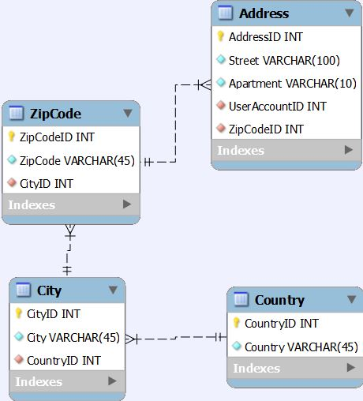

# Address, ZipCode, City, Country Tables

* Address table storing street and apartment data. Table holds foreign keys for the ZipCode and UserAccount tables. One user can have multiple addresses.
* ZipCode table storing zipcodes and holds a foreign key for the City table.
* City table storing city name and holds a foreign key for the Country table.
* Country table storing only country name data.