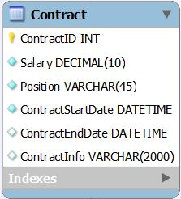

# Contract Table

* Table storing all contracts for the employees.
* Basic information about the employees like salary, position, contract stard and end dates, and contract info are stored in the table itself.
* Contract table inherits all the properties of the UserAccount Table.