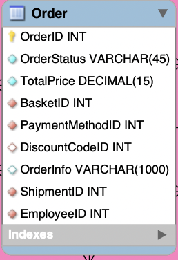

# Order table

- Stores necessary data when costumer orders a product
- Contains information such as order status, total price
- EmployeeID is a foreign key to UserAccount table which shows who has processed the order
- This table has many to many relationship with GifCard table
- An order can have many gift cards
