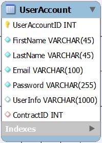

# UserAccount Table

* Table storing all registered users. Holds foreign key to the Contract table.
* Basic information about the user like first name, last name, e-mail, password and user info are stored in the table itself.
* The date the record was created and when the information was last updated are stored in the timestamps table.