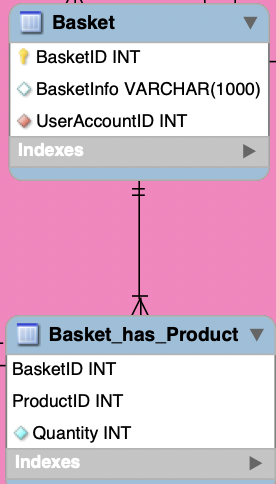

# Basket table

- Stores product's lists that costumer has selected to buy
- It contains User account id as foreign key.
- it has many to many relationship with Product table that is why we need the Basket_has_Product table.
- Basket_has_Product has quantity entity to save the quantity of the product in the basket.
