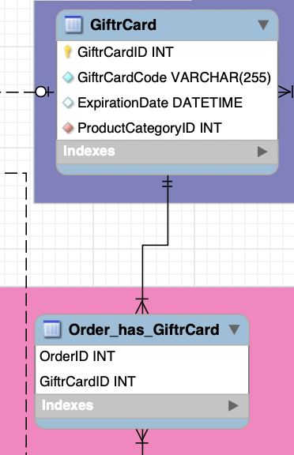

# Basket table

- It stores the gift card's code, expiration date and its balance
- Gift card is a type of product, for this reason it has ProductCategoryID as a foreign key
- Gift card can be used in orders. GiftCard table has many to many relation ship with Order table.
- An gift card can be used in many orders as long as it has sufficient balance.
