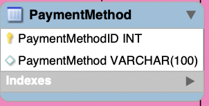

# PaymentMethod table

- Stores the data about the payment method of the ordered products.
- One payment method can be used in many orders. PaymentMethod has one to many relationship with Order table.
